# Event Organizer Application

## Screenshot

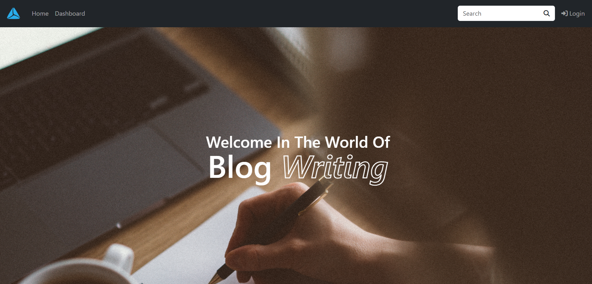
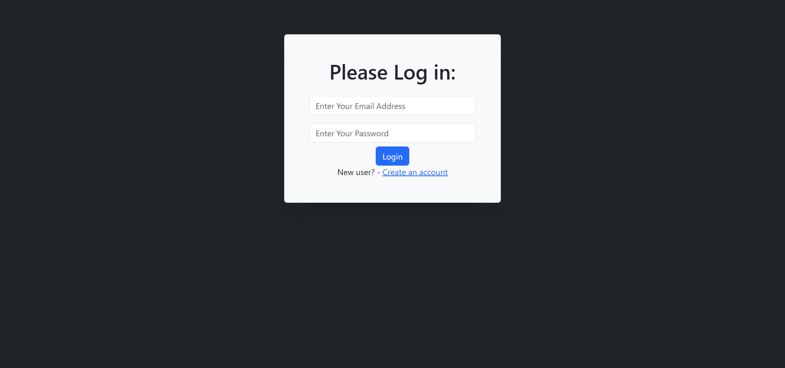
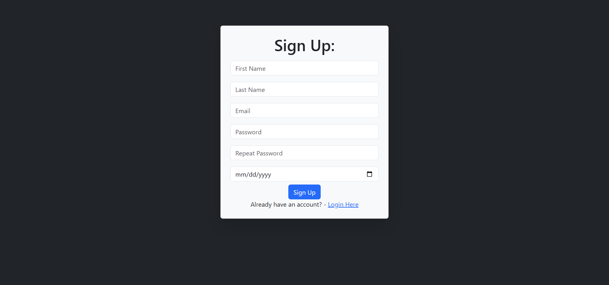
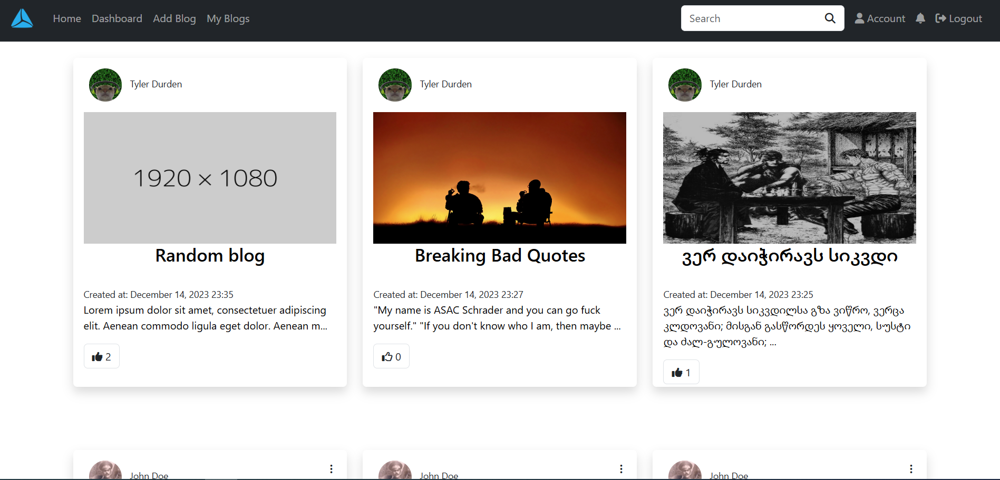
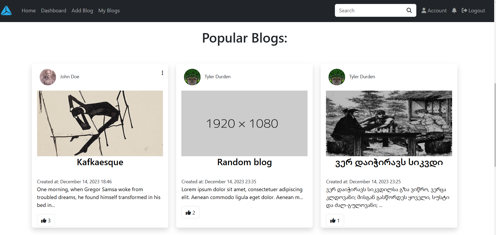
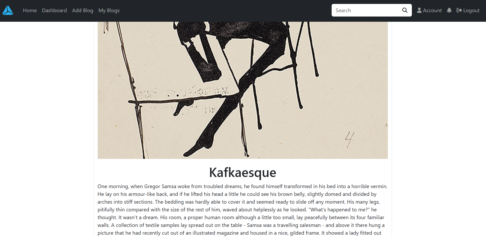
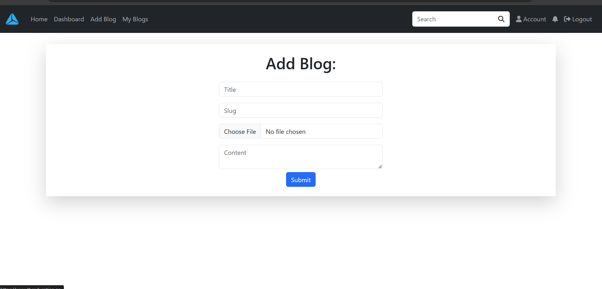
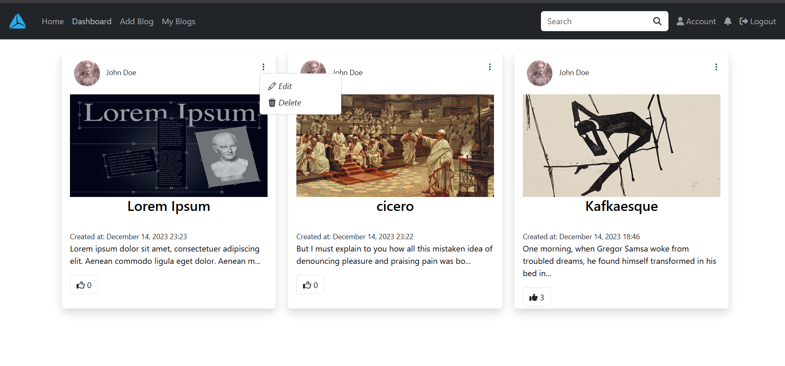
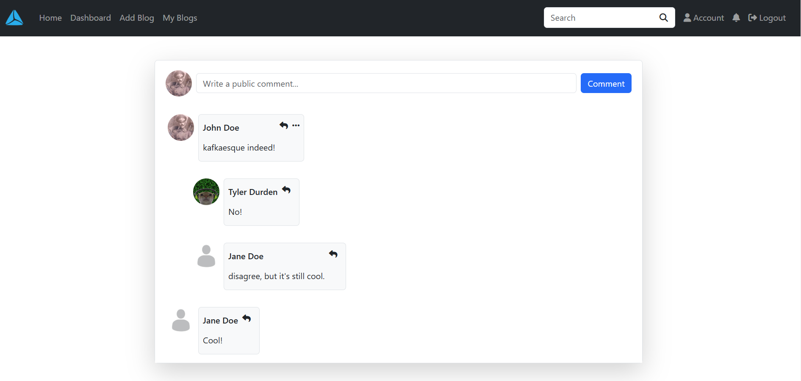
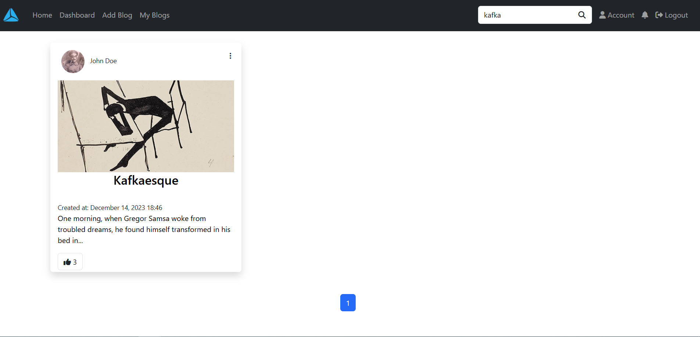
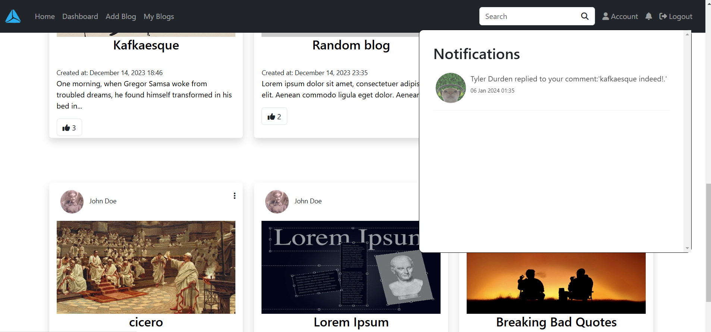
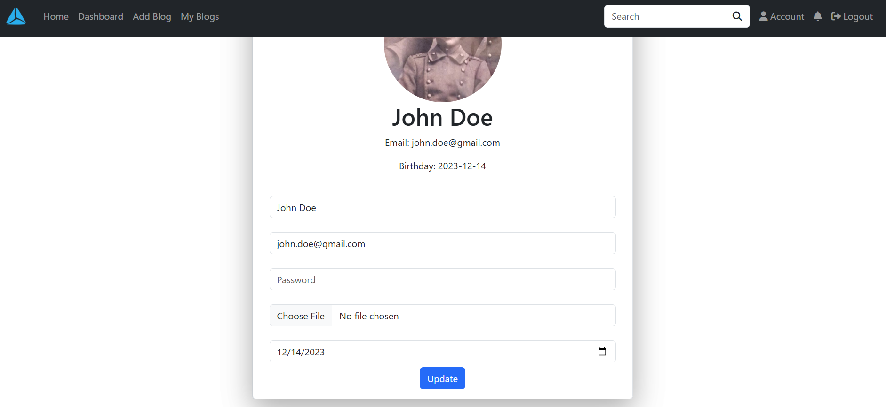

## Features

### Registration And Login 
Users can create their account and login with their password and email

### Blog Creation And Editing
Users can create,edit and delete blogs.

### Profile Details
Users can edit their profile details like: name,email,password and profile picture.

### Search Functionality
Anyone can search for blogs.

### Comments and replies
Users can comment on any blog post and reply to other comments.

### Likes and Notification Systems
Users can like any blog post and they get notified about their blog or comments.

## Built with

* Flask (python)
* HTML5
* CSS3
* Javascript
* SQLite
* SQLAlchemy
